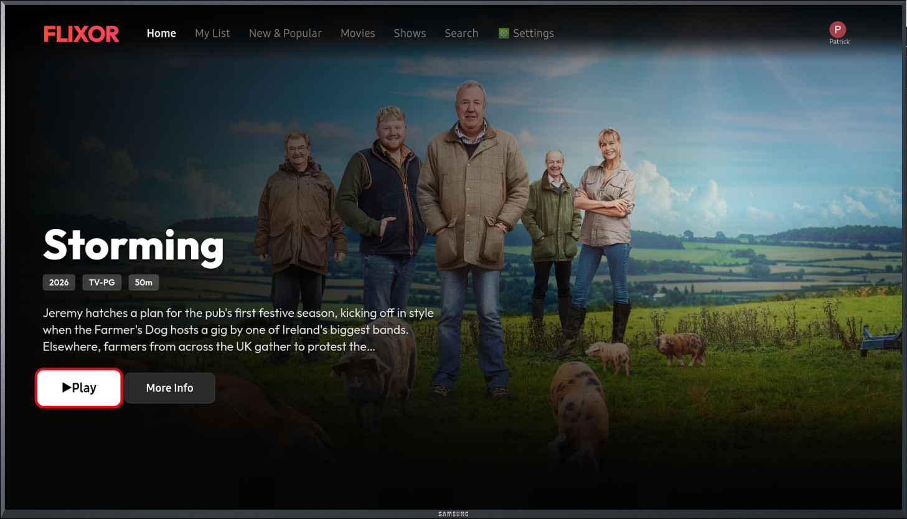
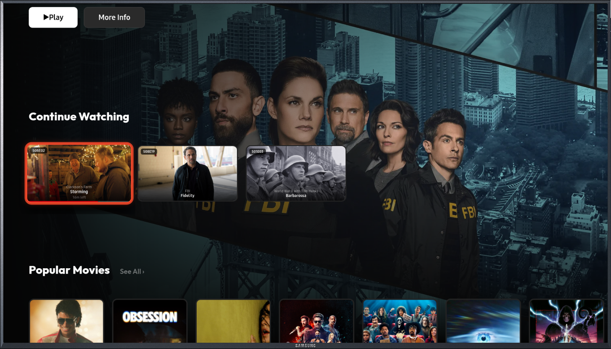
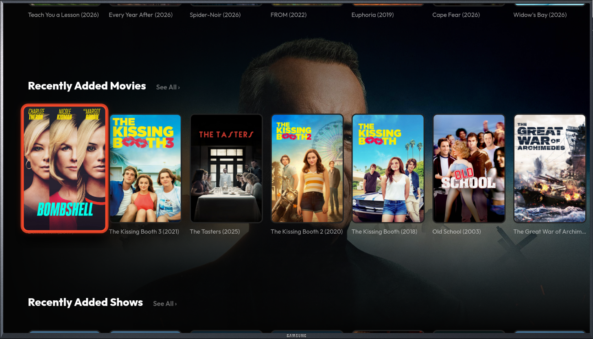
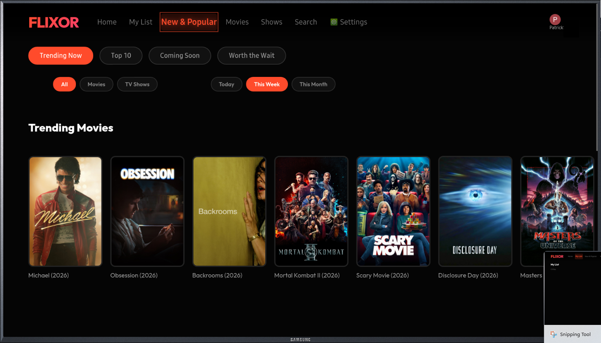
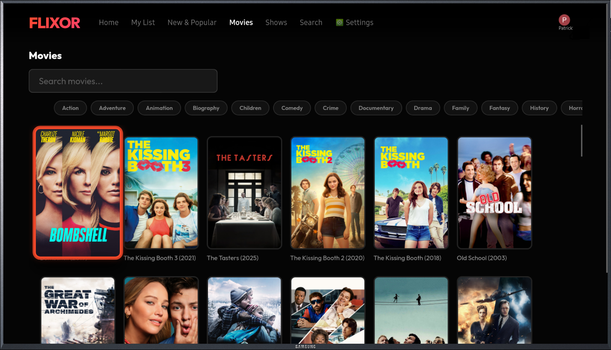
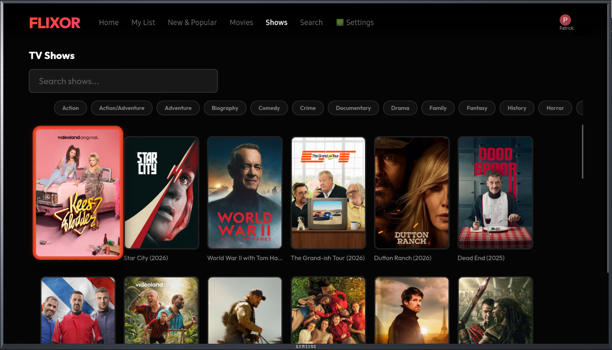
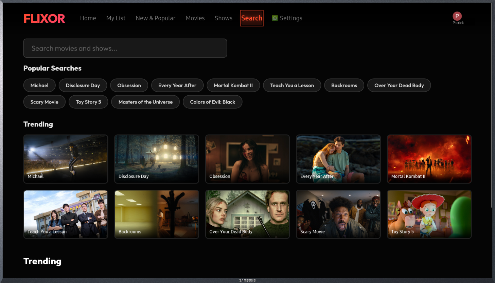
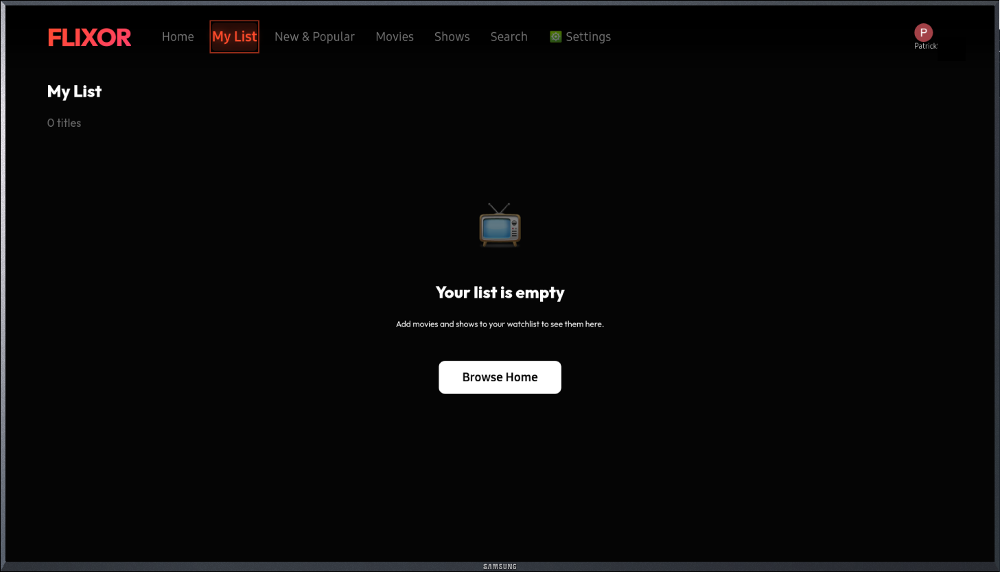
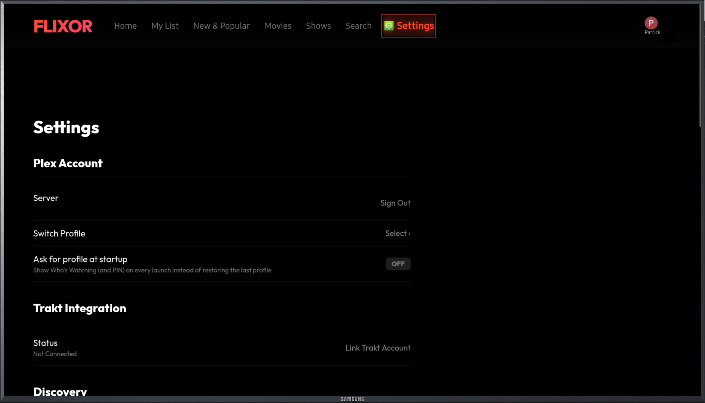

<a id="readme-top"></a>

<div align="center">
  <h1>Flixor for Samsung Tizen TV</h1>
  <p><strong>A beautiful, Netflix-style Plex client — running natively on your Samsung TV</strong></p>
  <p>Sideloadable <code>.wgt</code> · full remote navigation · no casting, no second device</p>
</div>

---

## What is this?

[Flixor](https://github.com/Flixorui/flixor) is a gorgeous, Netflix-style Plex
client. It ships for Web, macOS, iOS and Android — **but not for Samsung TVs.**

This project is an **unofficial port that packages Flixor as a sideloadable
Samsung Tizen TV app** (`.wgt`), so you can run it right on the television with
your remote — no Chromecast, no phone, no server-side plugin.

> **Credit where it's due:** all the app, design and features are the work of the
> original [**Flixor project**](https://github.com/Flixorui/flixor). This repo only
> does the work needed to make it run on a TV. Please ⭐ and support them too — see
> [Credits](#credits).

## What the port adds

Getting a modern web app to run on Samsung's **Chromium-63 WebView** took a fair
bit of work. On top of upstream Flixor, this port adds:

- **A Chrome-63-compatible build pipeline** — CSS/JS transforms for the old WebView
- **`.wgt` packaging & signing CI** — every push builds an installable, signed release
- **Direct-to-Plex authentication on the TV**, with an **on-screen PIN pad**
- **Full D-pad / remote spatial navigation** across the entire UI
- **Audio & subtitle selection** — before *and* during playback, with burned-in
  subtitles so they actually render on the TV
- **TV-first layout & CSS fixes** throughout (focus states, grids, hero, overlays)

> ⚠️ **Beta.** It boots, connects to your Plex server, browses your library, and
> plays movies & shows with audio/subtitle switching. There are still rough edges
> being worked through — bug reports and TV-model compatibility notes are very welcome.

## Screenshots

Running on a Samsung Tizen TV:

| Home | Continue Watching |
|------|-------------------|
|  |  |

| Recently Added | New & Popular |
|----------------|---------------|
|  |  |

| Movies | Shows |
|--------|-------|
|  |  |

| Search | My List |
|--------|---------|
|  |  |

| Settings | |
|----------|--|
|  | |

## Installation

1. **Enable Developer Mode** on your Samsung TV
   (Apps → press `1`, `2`, `3`, `4`, `5` on the remote → turn Developer Mode **On**,
   and enter your PC's IP).
2. **Download** the latest `Flixor.wgt` from the
   [**Releases**](https://github.com/PatrickSt1991/flixor-tizen/releases/latest) page.
3. **Sideload** it using any of:
   - [**Apps2Samsung installer**](https://github.com/Apps2Samsung/Apps2Samsung/releases/latest) (easiest — GUI, no SDK)
   - **Tizen Studio** (`Device Manager` → install `.wgt`)
   - **`sdb`** (`sdb install Flixor.wgt`)
4. Launch Flixor on the TV and sign in to Plex with the on-screen PIN.

Releases are signed with a stable author certificate, so new versions install
over previous ones (developer-mode install).

## Building from source

Requires **Node.js 22+**.

```bash
npm ci
npm run build:core              # build the @flixor/core package
npm run build -w flixor-tizen   # build the Tizen web bundle → apps/tizen/dist
```

`apps/tizen/dist` contains the web bundle plus the generated `config.xml` and icon.
Package and sign it into a `.wgt` with the Tizen CLI:

```bash
tizen package -t wgt -s <your-profile> -- apps/tizen/dist
```

Or just let CI do it — pushing to `main` builds and publishes a signed `.wgt`
(see [`.github/workflows/tizen-wgt.yml`](.github/workflows/tizen-wgt.yml)).

## Support the porting work

If this TV port is useful to you, you can support **the porting effort**
(this is separate from — and in addition to — the upstream project):

[**☕ ko-fi.com/patrickst**](https://ko-fi.com/patrickst)


## Credits

This port stands entirely on the shoulders of others:

- **[Flixor](https://github.com/Flixorui/flixor)** — the original Netflix-style
  Plex client. All of the app, its UI and its features are their work. ([Discord](https://discord.gg/flixor) · [r/flixor](https://www.reddit.com/r/flixor/))
  If you enjoy Flixor, please support the original authors (their Ko-fi is `flixor`).
- **[lusky3/flixor-tizen](https://github.com/lusky3/flixor-tizen)** — the earlier
  Tizen fork this work builds on.

## License

Distributed under the **Flixor Public License** — AGPL-3.0 with a
**Non-Commercial & Public-Source addendum** by the upstream copyright holder.
See [`LICENSE.md`](LICENSE.md) for the full terms.

In short: free for personal, non-commercial use; if you host or distribute a
modified version you must keep your complete source publicly available under the
same license (which this repository does). The "Flixor" name and logo belong to
the upstream project and are used here only to describe the origin of the software.

---

<p align="center">
  A community port for the Plex community — with thanks to the Flixor team.
</p>
